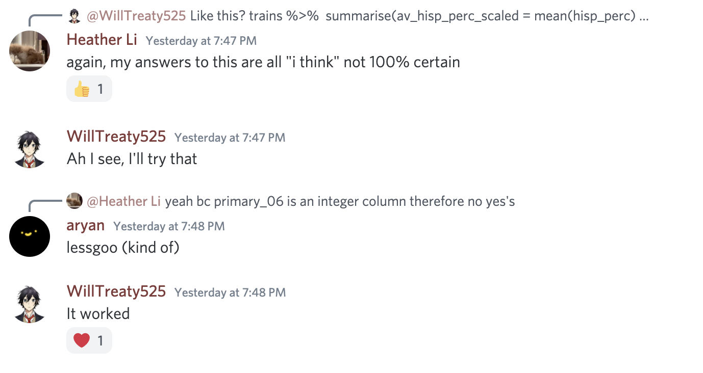
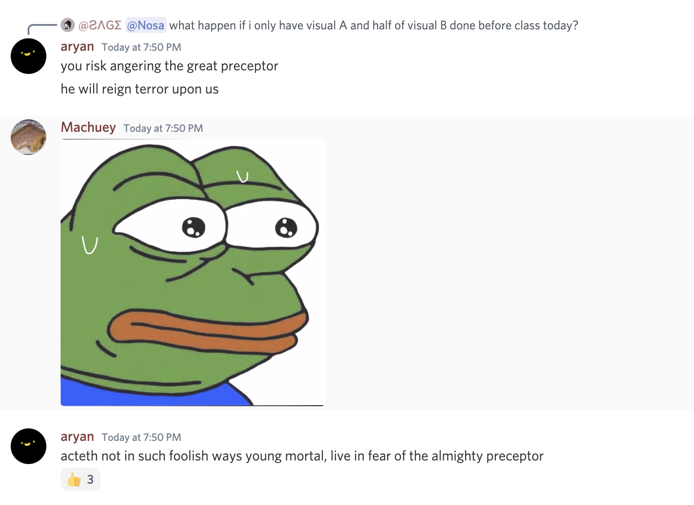

```{r setup, include=FALSE}
knitr::opts_chunk$set(echo = FALSE)
library(tidyverse)
library(gt)
library(ggthemes)
```

```{r}
errors <- tibble(Names = c("Emmanuel Buabeng", "Frank Li", "Stefan Arroyo-Cottier", "Frank Li", "Heather Li", "Heather Li", "Heather Li", "Ajay Malik", "Nuo Wen Lei", "Nuo Wen Lei", "Gabriel You", "Frank Li", "Yile Choi", "Daniel Wang", "Daniel Wang", "Fahim Ahmed", "Khush Makadia", "Ajay Malik", "Nuo Wen Lei", "Nuo Wen Lei", "Nuo Wen Lei", "Nuo Wen Lei", "Ajay Malik"),
   `Course Material` = c("GS-Tut. 1.7", "VisA 2.4", "VisA 6.5", "VisA 4.3", "VisB 2.6", "VisB 5.6", "VisB 3.2", "Tools-Tex.", "Vis C 2.3", "VisC 5.2", "VisC 5.6", "VisC 3.5", "VisA 3.5", "VisC 5.7", "VisC 4", "GS-Tut. 1", "VisC 7.8", "Term 2.5", "Term 3.3",  "Term 3.13", "Term 3.4", "Term 4.7", "Term 4.2" ),
   Date = c("6/1", "6/2", "6/2", "6/2", "6/2", "6/2", "6/2", "6/2", "6/3", "6/3", "6/3", "6/3", "6/3", "6/3", "6/3", "6/3", "6/3", "6/5", "6/5", "6/5", "6/5", "6/5", "6/5"))
```

```{r}
top_errors <- errors %>% 
  group_by(`Names`) %>% 
  summarize(`Score` = n()) %>% 
  arrange(desc(`Score`)) %>% 
  slice(1:5) 

ggplot(top_errors, aes(`Names`, `Score`, fill = `Score`)) + 
  geom_col(bins = 5) +
  theme_clean() +
  theme(legend.position = "none") +
  labs(title = "Error Catching Leaderbord", 
       subtitle = paste(top_errors$Names[1], "is in the lead"),
       x = "", 
       y = "Errors Caught", 
       caption = "Source: Kane's DS Bootcamp Discord (2021)")
```

We began the course on 6/1 with a class of 81 students. We have been able to install the necessary software (R and Rstudio) on every computer except one which we are still troubleshooting. On 6/2, we met again with a class of 79 students, inclduding new members from last-minute recommendations. On 6/4, we held our third meeting with roughly 60 students.

 Heather Li had the early lead, catching the most and most major mistakes the first two days. Because the errors were bigger, many people kept expressing their confusion in the Discord. Heather responded to nearly all of them. Nuo Wen

```{r heather}

```

Kudos to many, many others who have maintained a nice balance of asking and answering questions. It has been exciting to watch. Kudos also to libryan261, who asked a question, figured it out himself, and then posted how he solved it for the benefit of others. 

Another shoutout to Ajay Malik, who taught the me and the other course staff how to format code better in Discord. 

A final shoutout to Aryan rightly warned all to fear Preceptor. Kudos also to Machuey for his choice image.

```{r almight-preceptor}

```
As of 6/5, the course has welcomed four students to its staff as teaching fellows: Heather Li, Nuo Wen Lei, Ajay Malik, and Stephanie Saab.

```{r}
rmarkdown::paged_table(errors)
```

If you feel this list is incomplete, reach out to one of the course staff. 
