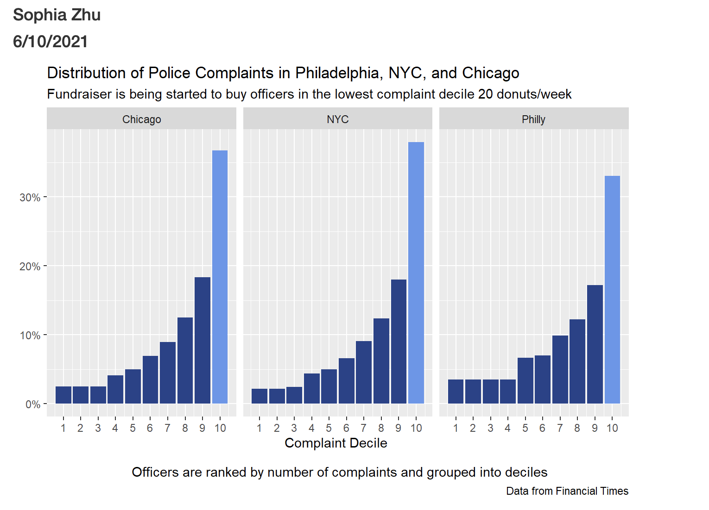
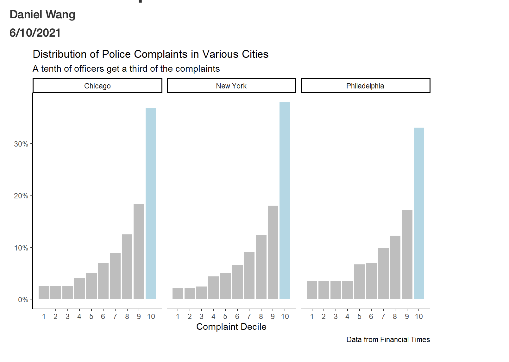
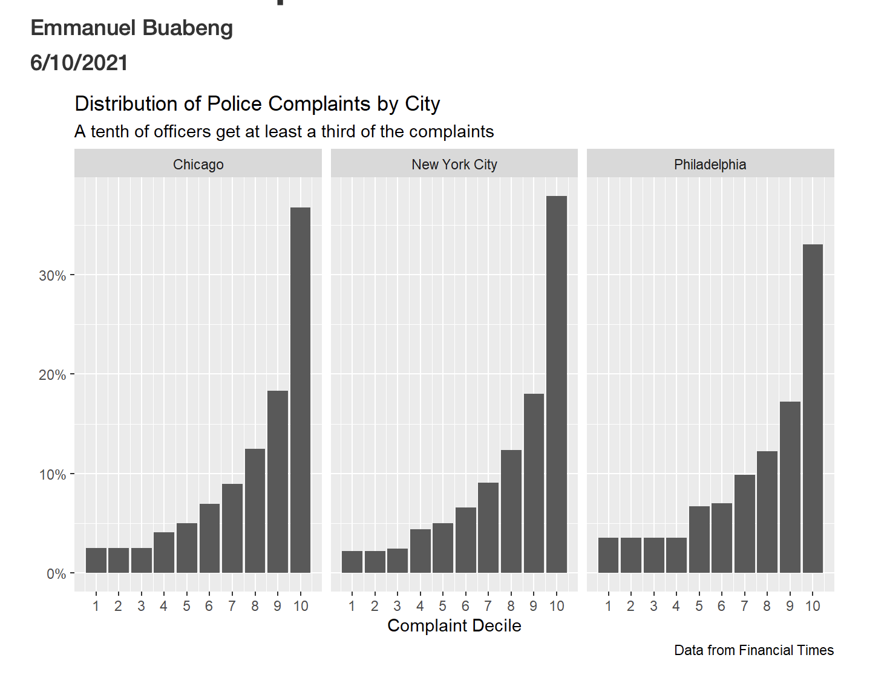
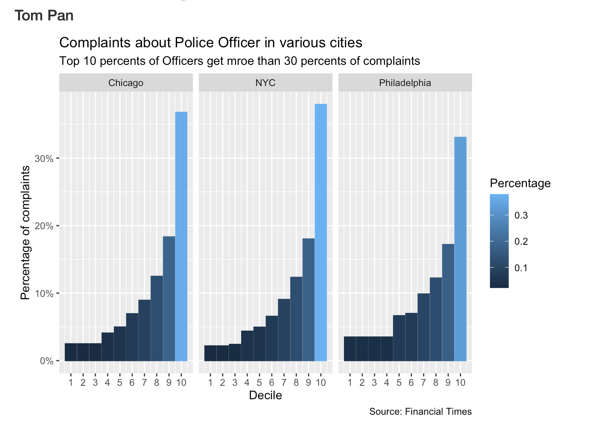
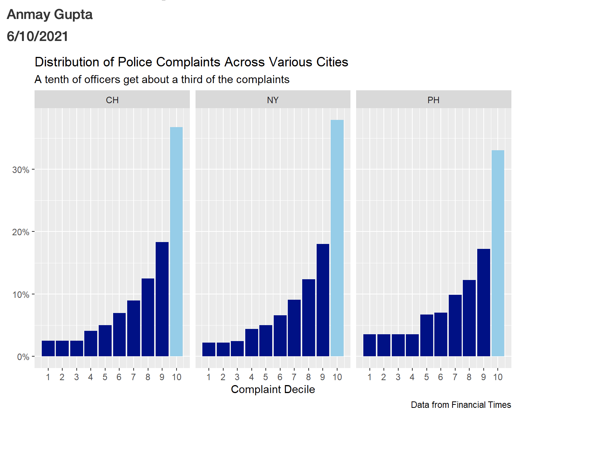
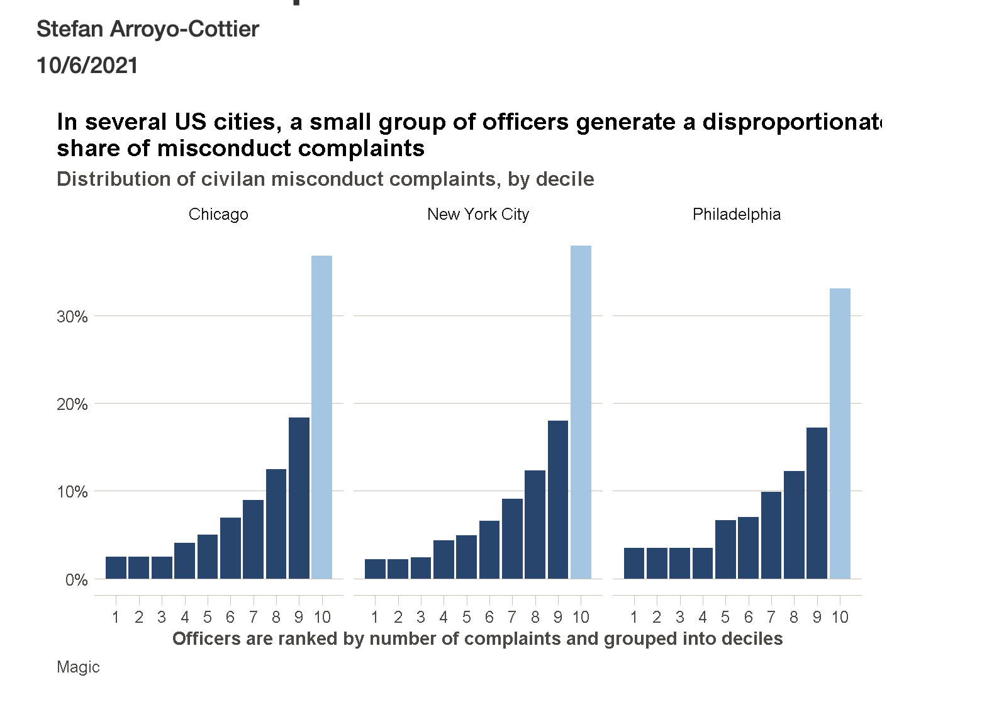
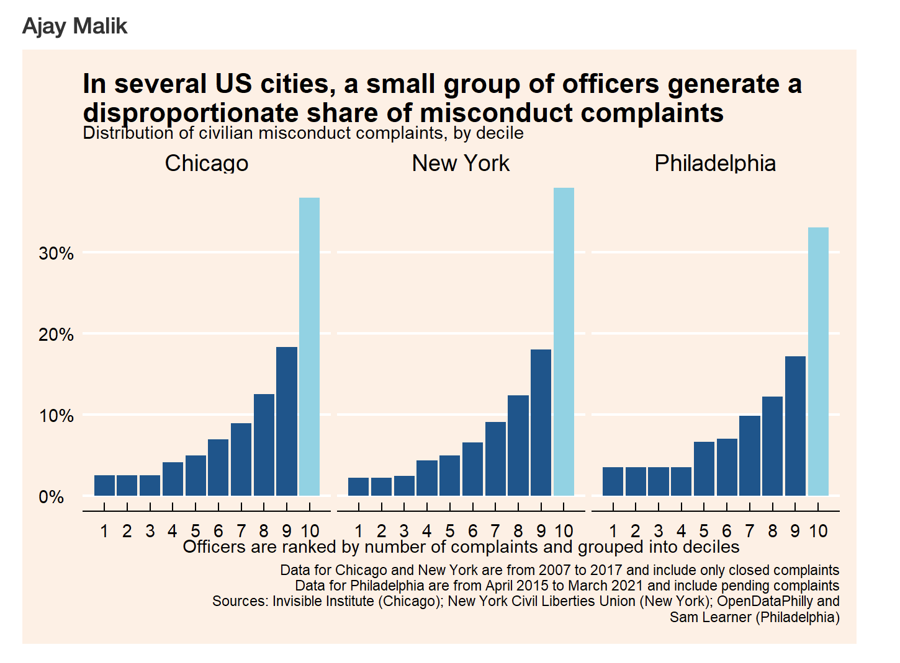
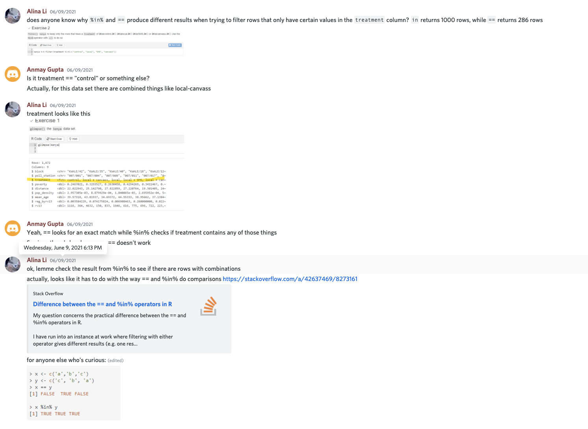

```{r setup, include=FALSE}
knitr::opts_chunk$set(echo = FALSE)
library(tidyverse)

# for graph theme

library(ggthemes)

# for date

library(lubridate)

# It is somewhat sloppy to include a read_csv() command in the setup chunk.
# Normally, we would just load libraries here. However, we have not learned
# about the col_types argument to read_csv() yet, so we can't make the annoying
# message go away unless we stick the call in a code chunk with a code chunk
# option like message = FALSE or include = FALSE.

# It is also better practice to save a purely unwrangled copy of data you call 
# from an outisde source. Again, ideally not in the setup chunk.

raw_data_philadelphia <- read_csv("https://raw.githubusercontent.com/Financial-Times/police-misconduct-complaints-analysis/main/output/philly_clean.csv", 
                         col_types = cols()) 

raw_data_ph <- raw_data_philadelphia %>% 
  select(officer_id)  

# Do the same for NYC and Chicago. For Chicago, use arrange() function and 
# comparison with other columns to decide between crid and UID. 

raw_data_newyork <- read_csv("https://raw.githubusercontent.com/Financial-Times/police-misconduct-complaints-analysis/main/output/nyc_clean.csv") 

raw_data_ny <- raw_data_newyork %>% 
  select(OfficerID)

raw_data_chicago <- read_csv("https://raw.githubusercontent.com/Financial-Times/police-misconduct-complaints-analysis/main/output/chicago_clean.csv") 

raw_data_ch <- raw_data_chicago %>% 
  select(UID)
```

```{r error}
errors <- tibble(Names = c("Emmanuel Buabeng", "Frank Li", "Stefan Arroyo-Cottier", "Frank Li", "Heather Li", "Heather Li", "Heather Li", "Ajay Malik", "Nuo Wen Lei", "Nuo Wen Lei", "Gabriel You", "Frank Li", "Yile Choi", "Daniel Wang", "Daniel Wang", "Fahim Ahmed", "Khush Makadia", "Ajay Malik", "Nuo Wen Lei", "Nuo Wen Lei", "Nuo Wen Lei", "Nuo Wen Lei", "Ajay Malik", "Nuo Wen Lei", "Daniel Wang", "Anmay Gupta", "Ajay Malik", "Ajay Malik", "Ajay Malik", "Anmay Gupta", "Ajay Malik", "Abhay Paidpalli", "Nuo Wen Lei", "Anmay Gupta", "Ajay Malik", "Anmay Gupta", "Ajay Malik", "Nuo Wen Lei", "Nuo Wen Lei", "Stephanie Saab", "Heather Li"),
   `Course Material` = c("GS-Tut. 1.7", "VisA 2.4", "VisA 6.5", "VisA 4.3", "VisB 2.6", "VisB 5.6", "VisB 3.2", "Tools-Tex.", "Vis C 2.3", "VisC 5.2", "VisC 5.6", "VisC 3.5", "VisA 3.5", "VisC 5.7", "VisC 4", "GS-Tut. 1", "VisC 7.8", "Term 2.5", "Term 3.3",  "Term 3.13", "Term 3.4", "Term 4.7", "Term 4.2", "WrangC 2.7", "WrangC 2.17", "Wrang D 2.4-5",
"WrangB 1.5", "WrangC 5.22", "WrangD 1.5", "WrangC", "WrangA 2.5", "WrangC 2", "WrangC 2", "WrangD 1.9, 2.7, 3.7", "WrangB 2.11", "WrangC 4.14", "WrangB 5.7", "WrangC 4.6", "WrangB 5", "WrangB 2.3", "WrangD 2.1"),

# this is a lubridate function. This is part of Tidyverse in name but still needs a package. They say it is convenient. 

  # base R
  # Date = as.POSIXct(c(...), format = %m%d)

   Date = parse_date_time(c("6/1", "6/2", "6/2", "6/2", "6/2", "6/2", "6/2", "6/2", "6/3", "6/3", "6/3", "6/3", "6/3", "6/3", "6/3", "6/3", "6/3", "6/5", "6/5", "6/5", "6/5", "6/5", "6/5", "6/9", "6/9", "6/7", "6/9", "6/11", "6/11", "6/7", "6/7", "6/7", "6/7", "6/8", "6/7", "6/7", "6/8", "6/8", "6/8", "6/8", "6/9"), orders = "md")) %>% 
  arrange(Date) %>% 

# here we convert back to character to reemove that format. arranging after this will not arrange right.

  mutate(Date = str_replace(Date, "0000-", ""))
```


```{r error-plot}
top_errors <- errors %>% 
  group_by(`Names`) %>% 
  summarize(`Score` = n()) %>% 
  arrange(desc(`Score`)) %>% 
  slice(1:5) 

error_plot <- ggplot(top_errors, aes(`Names`, `Score`, fill = `Score`)) + 
  geom_col(bins = 5) +
  theme_clean() +
  theme(legend.position = "none") +
  labs(title = "Error Catching Leaderbord", 
       subtitle = paste(top_errors$Names[1], "is in the lead"),
       x = "", 
       y = "Errors Caught", 
       caption = "Source: Kane's DS Bootcamp Discord (2021)")

error_plot
```

```{r for a different plot later}

plot_raw_data_ph <-  raw_data_philadelphia %>% 
  select(officer_id, po_race)

plot_raw_data_ny <-  raw_data_newyork %>% 
  select(OfficerID, OfficerRace) %>% 
  rename(po_race = OfficerRace) 

plot_raw_data_ch <- raw_data_chicago %>% 
  select(UID, officer_race) %>% 
  rename(po_race = officer_race)
```

## Starting Data: Philadelphia

This was the first data we considered. We, like the article, moved  first to consider the number of complaints for each officer. However, there is a lot of other detail in these data sources that can be considered. 

```{r for philly presenting on distill}
rmarkdown::paged_table(raw_data_philadelphia)
```

```{r cleaning}

# This code makes a table that lets us know how many times each officer id appeared 
# in the tibble, i.e. how many complaints each officer has.

data_ph <- raw_data_ph %>% 
  group_by(officer_id) %>% 
  summarise(total = n()) %>% 
  
# We now want to know in which percentile (out of 10) each officer is, based on
# the amount of complaints he has. We could use mutate and percentile, as we did 
# multiple times in Wrangling B. But ntile() accomplishes the same in less code.
  
  mutate(compl_dec = ntile(total, 10)) %>% 
  
# As you build a pipe, you want to look at the result after each step to make
# sure it does what you want. Only after it is working would you then assign
# the result to an object which you can use later. 
  
# We want to know the total number of complaints in each decile of officers.
  
  group_by(compl_dec) %>% 
  summarize(compl_total = sum(total)) %>% 
  
# The graph needs total complaints as a percentage, which is easy to
# calculate. Then, we only keep around the variables we need for the plot.
  
  mutate(compl_perc = compl_total / sum(compl_total)) %>% 
  select(compl_dec, compl_perc)

 # Do the same for New York and Chicago. Cannot copy exactly because of differing
 # names for the officer column. 

data_ny <- raw_data_ny %>% 
 group_by(OfficerID) %>% 
  summarize(total = n()) %>% 
  mutate(compl_dec = ntile(total, 10)) %>% 
  group_by(compl_dec) %>% 
  summarize(compl_total = sum(total)) %>% 
  mutate(compl_perc = compl_total / sum(compl_total)) %>% 
  select(compl_dec, compl_perc) 
  
 data_ch <- raw_data_ch %>% 
  group_by(UID) %>% 
  summarize(total = n()) %>% 
  mutate(compl_dec = ntile(total, 10)) %>% 
  group_by(compl_dec) %>% 
  summarize(compl_total = sum(total)) %>% 
  mutate(compl_perc = compl_total / sum(compl_total)) %>% 
  select(compl_dec, compl_perc) 
```

```{r for different plot later}
# Good Lesson:
#    We used a lot of summarize in class last week but we were not really doing 
# summary. Our summarizing worked as wrangling because of the simplicity of our
# tibbles. We started with a tibble of one column. Here, you will see me try to include 
# race in two ways. The commented below  uses our method in class with my two 
# variable tibble, and the other uses group_by() and mutate(). The two work 
# together like summarize(), but you don't have to remove your other columns. It 
# requires more attention to what operation you want and which groups you are keeping. 

# plot_data_ph_int <- plot_raw_data_ph %>% 
#   group_by(officer_id) %>% 
#   summarize(total = n()) %>% 
#   left_join(plot_raw_data_ph, ., by = "officer_id") %>% 
#   mutate(compl_dec = ntile(total, 10))

# left join (with original tibble) trick will not work after this summarize without 
# break in tibble, because, unlike officer_id, common column is a
# new column created by ntile() and so does exist in starting tibble.

# plot_data_ph <- plot_data_ph_int %>% 
#   group_by(compl_dec) %>% 
#   summarize(compl_total = sum(total)) %>% 
#   mutate(compl_perc = compl_total / sum(compl_total)) %>% 
#   left_join(plot_data_ph_int, ., by = "compl_dec") %>% 
#   select(compl_dec, compl_perc, po_race) %>% 
#   mutate(city = "Philadelphia")


# MUTATE AND GROUP_BY()

plot_data_ph <- plot_raw_data_ph %>%
  group_by(officer_id, po_race) %>%
  mutate(complaints = n()) %>%

# You don't want to group with ntile! It gives unequal percentages...
  
  ungroup() %>%
  mutate(deciles = ntile(complaints, 10)) %>%
  arrange(desc(deciles)) %>%
  group_by(deciles) %>%
  mutate(dectotal = sum(complaints)) %>% 

# This complaint percentage is different than the one we calculated in class. 
# This is the percent each person contributes to their decile as a percent. This
# allows us to compare group contributions in complaints to each decile without
# taking into account the complaints per decile. 
  
  mutate(compl_perc = complaints / sum(complaints)) %>% 
  mutate(city = "Philadelphia") 

plot_data_ny <- plot_raw_data_ny %>%
  group_by(OfficerID, po_race) %>%
  mutate(complaints = n()) %>%
  ungroup() %>%
  mutate(deciles = ntile(complaints, 10)) %>%
  arrange(desc(deciles)) %>%
  group_by(deciles) %>%
  mutate(dectotal = sum(complaints)) %>% 
  mutate(compl_perc = complaints / sum(complaints)) %>% 
  rename(officer_id = OfficerID) %>% 
  mutate(city = "New York")

plot_data_ch <- plot_raw_data_ch %>%
  group_by(UID, po_race) %>%
  mutate(complaints = n()) %>%
  ungroup() %>% 
  mutate(deciles = ntile(complaints, 10)) %>%
  arrange(desc(deciles)) %>%
  group_by(deciles) %>%
  mutate(dectotal = sum(complaints)) %>% 
  group_by(deciles) %>% 
  mutate(compl_perc = complaints / sum(complaints)) %>% 
  rename(officer_id = UID) %>% 
  mutate(city = "Chicago") 
```

```{r joining}
# Prepare data for joining. Add city column. This does not have to be a separate
# code chunk, this is just to demarcate a new breakout session. 

data_ph <- data_ph %>% 
  mutate(city = "Philadelphia")

data_ny <- data_ny %>% 
  mutate(city = "New York")
  
data_ch <- data_ch %>% 
  mutate(city = "Chicago")
  
  
clean_data <- bind_rows(data_ph, data_ny, data_ch) 
```

```{r joining for different plot later}
with_race_data <- bind_rows(plot_data_ph, plot_data_ny, plot_data_ch)
```

## Similar Class of Top of Offenders in All Three Cities

It is interesting not only that there is a class of unusually high offenders,  but also that in every city this class contributes roughly the same proportion  of complaints, 1/3. Are there other similarities between these groups in each city besides how many complaints they earn?

```{r for presenting clean on distill}
clean_data_presentation <- clean_data %>% 
  rename(deciles_of_officers_by_complaint_totals = compl_dec,
         percentage_of_complaints_in_decile =  compl_perc)

rmarkdown::paged_table(clean_data_presentation)
```

## Plots

The class made several nice renditions of the data above, including Sophia, who has already started working  a policy proposal. The numbers in our analysis differs from that presented in the FT Article, perhaps because they were more discriminate among investigations that have not yet closed.


```{r, plotting}
# An if_else statements allows us to change the color only if the tenth 
# decile is equal to 10. We will do this if we have time. 
  
  # allows for r code comented below
  # fill_dec <- if_else(clean_data$compl_dec == 10, "lightblue", "grey")


# We could just have one giant pipe which goes directly into ggplot(), like we
# do in the tutorials. There is nothing wrong with that approach, but it is
# often easier to split your work up into separate parts, the better to make
# sure that each part is doing what you want.

plot <- clean_data %>% 
  ggplot(aes(x = compl_dec, y = compl_perc)) +
  geom_col(fill = if_else(clean_data$compl_dec == 10, "lightblue", "grey")) +

# color fill (without an aesthetic) did not work in ggplot here. unfortunately 
#could not omit the fill argument.

  # provided R object commented above
  # clean_data %>%
  # ggplot(aes(compl_dec, compl_perc)) +
  # geom_col() +

  labs(title = "Distribution of Police Complaints among Deciles",
         subtitle = "In all cities, one tenth of officers get nearly a third of the complaints",
         x = "Complaint Decile",
         y = NULL,
         caption = "Financial Times (2021)") +
  facet_wrap(~ city, nrow = 1) +
  scale_x_continuous(breaks = 1:10) +
  scale_y_continuous(labels = scales::percent_format(accuracy = 1)) 
```

```{r plots}
 
 
 
 
 
 
 
```

## Race

After briefly touching on race and policing earlier in the article, the article moved to discuss and show an interesting graphic on social groups and number of complaints. The following graph and table considers the racial composition of complaint deciles. 

```{r different plot}

with_race_data_final <- with_race_data %>% 
  group_by(city) %>% 
  mutate(sum_compl_perc = sum(compl_perc)) %>% 
  
  # the case string functions can save a lot of typing
  
  mutate(race = str_to_title(po_race), 
         race = str_replace(race, "American Indian", "Indian"),
         race = str_replace(race, "Native American/Alaskan Native", "Indian"), 
         race = str_replace(race, "Latino", "Hispanic"), 
         race = str_replace(race, "Asian/Pacific Islander", "Asian"))

different_plot <- with_race_data_final %>% 
  
  # I want blacks and whites to have the edge positions, since those positions 
  # allow fluctuation to be seen most clearly and those races are the most discussed
  # when discussing race and policing.
  
  mutate(race = factor(race, 
                       levels = c("Black", "Asian", "Hispanic", "Indian", "Other", "White", "NA"))) %>% 

# geom_col is by default stacked. This allows ggplot to assign colors to individual
# members of a tibble. However, this adds the y attribute of each row. If y were only 
# compl_perc, the percentages would be large and disproportionate to those of 
# other cities. To remedy this, we created a column in the tibble which is the 
# sum the compl_perc for every row of that city in the tibble. The result is graphs
# with coloring for race that are also proportionate to each other.
  
  ggplot(aes(deciles, y = compl_perc, fill = race)) +
  geom_col() +
  labs(title = "Racial Composition of Complaints in Complaint Deciles",
       subtitle = "Racial composition is percent complaints filed against race", 
       x = "Complaint Decile",
       y = NULL,
       fill = "Race",
       caption = "Financial Times (2021)") +
  facet_wrap(~ city) +
  scale_x_continuous(breaks = c(1:10)) +
  scale_y_continuous(labels = scales::percent_format()) +
  theme_dark() +
  scale_fill_manual(values = c("black", "yellow", "brown", "red", "grey", "white", "grey"))


different_plot 
```

```{r different tablel}
 race_in_decile <- with_race_data_final %>% 
  as_tibble() %>% 
  group_by(city, race, deciles) %>% 
  mutate(total_race_in_decile = n()) %>% 
  group_by(city, deciles) %>% 
  mutate(total_in_decile = n()) %>% 
  group_by(city, total_race_in_decile, total_in_decile, race, deciles) %>% 

  # summaeize() will process this function like mutate() if the mean() function 
  # is excluded
  
  summarize(percent_race_in_decile = mean(total_race_in_decile / total_in_decile), 
            .groups = "drop") %>% 
  filter(race %in% c("White", "Black", "Asian", "Hispanic")) %>% 
  arrange(city, race, deciles) %>% 
  
# select(-) does not seem to work if tibble is still grouped by the variable  
  
  select(-total_in_decile)
```

Unlike in the plot, racial composition here is percent members of race in a decile.

```{r}
rmarkdown::paged_table(race_in_decile) 
```

There remain many questions that could be explored on this data. First on my mind how many officers are excluded from this data? i.e. How many officers have never recieved a complaint? Alina's dogged pursuit of an answer to her own question on the Discord this week answered a question I had had for a long time. 

```{r alina}
 
```

```{r error-table}
rmarkdown::paged_table(errors)
```

If you feel this list is incomplete, reach out to one of the course staff. 
